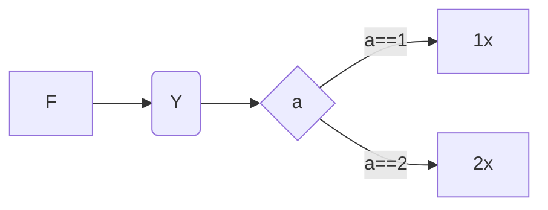

|      |      |      |
| ---- | ---- | ---- |
|      |      |      |
|      |      |      |
|      |      |      |

------

```

```

$$
A*B = C
$$

[TOC]




>
>
>aaaaaaa

### CommandBuffer State

+ Initial
+ Recording
+ Excutable
+ Pending
+ Invalid


```cpp
template<typename T>
concept lua_acceptable_t = is_same_v<float, T>;


template<lua_acceptable_t T>
void flush_resource(T&& waiter)
{
    waiter.contact();
}
```

```flow
st=>start: begin
op=>operation: handle
cond=>condition: yes?
sub1=>subroutine: sub
io=>inputoutput: inout
e=>end: endout

st->op->cond
cond(yes)->io->e
cond(no)->sub1(right)->op
```


```GeoJSON
{
  "type": "FeatureCollection",
  "features": [
    {
      "type": "Feature",
      "id": 1,
      "properties": {
        "ID": 0
      },
      "geometry": {
        "type": "Polygon",
        "coordinates": [
          [
              [-90,35],
              [-90,30],
              [-85,30],
              [-85,35],
              [-90,35]
          ]
        ]
      }
    }
  ]
}
```

